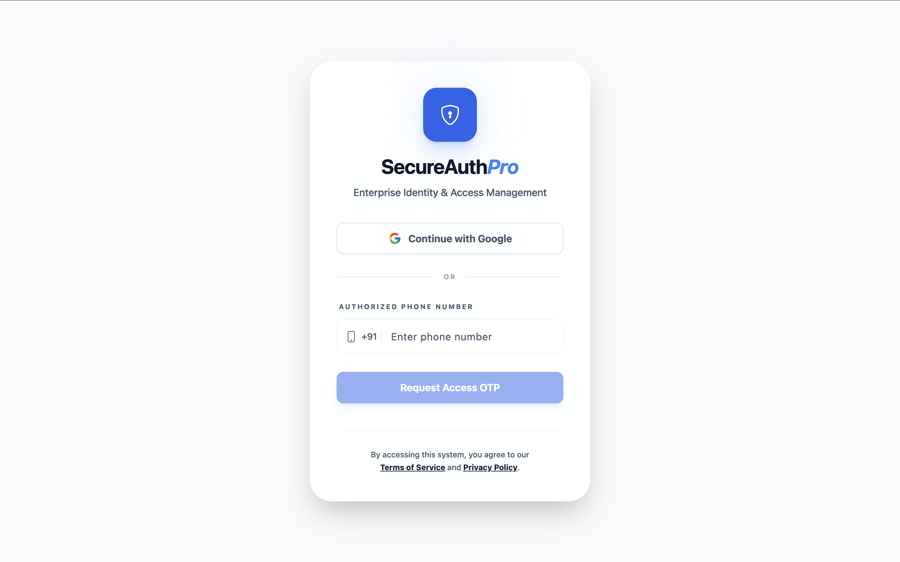
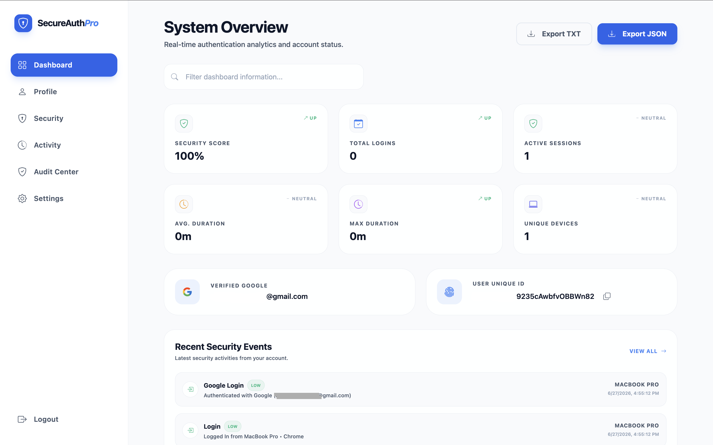
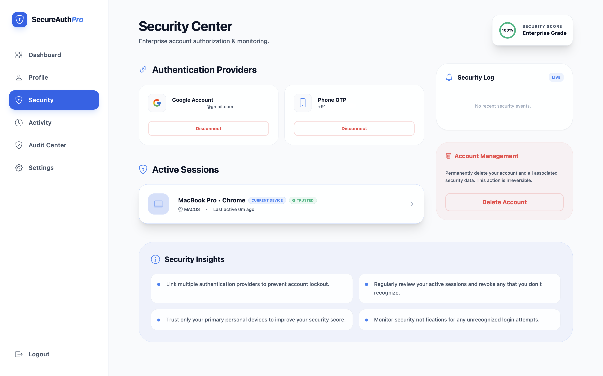
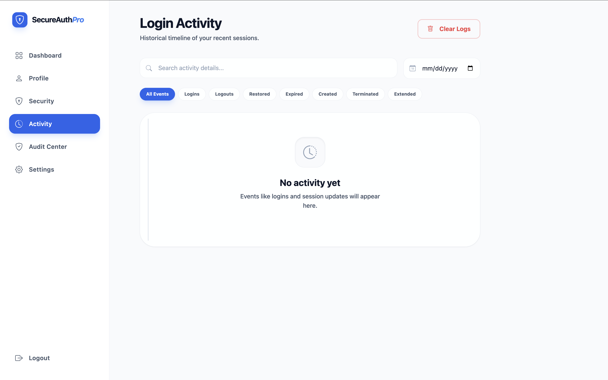
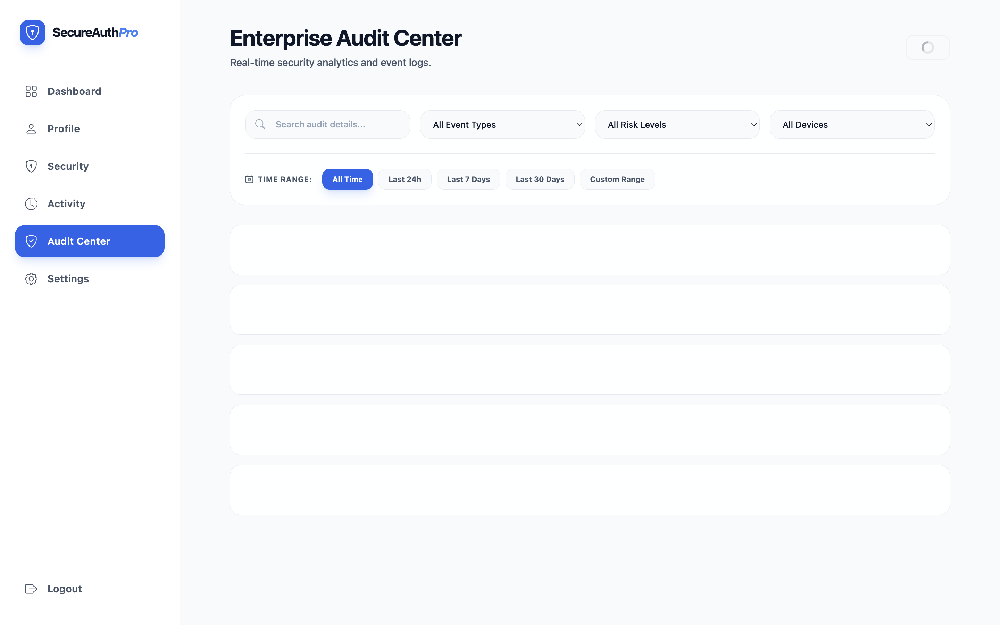
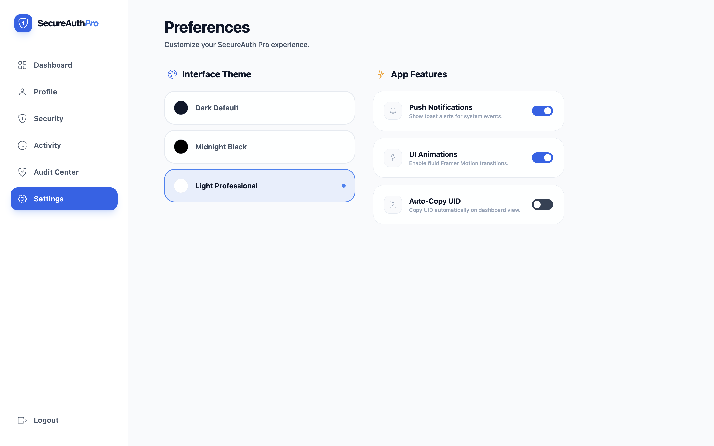

# SecureAuth-OTP 🛡️

[](https://react.dev)
[](https://vitejs.dev)
[](https://firebase.google.com)
[](https://firebase.google.com/docs/firestore)
[](https://playwright.dev)
[](https://vitest.dev)
[](https://opensource.org/licenses/MIT)

SecureAuth-OTP is a production-ready, enterprise-grade multi-provider identity and access management system built with React, Firebase Authentication, Cloud Firestore, and Vite. The application showcases advanced session integrity management, real-time cross-tab synchronization, trusted device evaluation, and security monitoring.

🚀 **Live Demo**:
[https://auth-otp-8693d.web.app](https://auth-otp-8693d.web.app)

📂 **GitHub Repository**:
[https://github.com/garv999/SecureAuth-OTP](https://github.com/garv999/SecureAuth-OTP)

---

## 📋 Table of Contents

- [Features](#features)
- [Tech Stack](#tech-stack)
- [Project Architecture](#project-architecture)
- [Folder Structure](#folder-structure)
- [Installation](#installation)
- [Production Build](#production-build)
- [Testing](#testing)
- [Security Features](#security-features)
- [Performance Optimizations](#performance-optimizations)
- [Deployment](#deployment)
- [Future Improvements](#future-improvements)
- [Author](#author)

---

## ✨ Features

* **Multi-Provider Authentication**: Instant Google Login and SMS-based Phone OTP login with reCAPTCHA.
* **Account Linking & Merging**: Dynamically link multiple authentication credentials (Google + Phone) to a single profile.
* **Active Session Management**: Interactive list of active sessions with remote revocation capabilities.
* **Trusted Devices**: Hardware trust designation utilizing device fingerprinting to skip secondary checks.
* **Cross-Tab Synchronization**: Instant synchronization of Theme, User settings, Trusted devices, Active sessions, and History logs across tabs via browser Storage Events (zero page-reloads).
* **Security Dashboard**: Core key metrics dashboard summarizing logins, session status, device types, and real-time security events.
* **Audit Center**: Immutable security event logs with client-side query filters, risk-level badges, and scroll-based pagination.
* **Responsive UI**: Sleek dark and light mode theme support with smooth micro-animations powered by Framer Motion.
* **Error Boundaries**: Root-level error boundary capturing catastrophic failures to prevent state leaks.
* **Session Restoration**: Silent session restoration upon browser refresh, secured against stale storage keys.
* **Defensive Runtime Hardening**: Optional chaining, strict JSON parsers, and type checks to protect the client from corrupted Firestore documents or database schema migrations.

---

## 📸 Screenshots

Below are placeholders for the visual interface layouts of the project:

### 1. Login Page


### 2. Dashboard Overview


### 3. Security Page


### 4. Activity Timeline


### 5. Audit Center


### 6. Settings Page


---

## 🛠️ Tech Stack

* **Frontend Framework**: [React 19](https://react.dev) + [Vite](https://vitejs.dev)
* **Routing**: [React Router DOM v6](https://reactrouter.com/)
* **Animations**: [Framer Motion](https://www.framer.com/motion/)
* **Database & Auth**: [Firebase v10](https://firebase.google.com/) (Authentication & Cloud Firestore)
* **Styling**: Vanilla CSS custom variables & CSS modules
* **Unit Testing**: [Vitest](https://vitest.dev) + [React Testing Library](https://testing-library.com/)
* **End-to-End Testing**: [Playwright](https://playwright.dev)
* **CI/CD**: GitHub Actions

---

## 🏛️ Project Architecture

```
                                +-------------------+
                                |    React Client   |
                                +---------+---------+
                                          |
                     +--------------------+--------------------+
                     |                                         |
                     v                                         v
           +---------+---------+                     +---------+---------+
           | Firebase Auth SDK |                     |  Firestore SDK    |
           +---------+---------+                     +---------+---------+
                     |                                         |
                     v (Token / OAuth)                         v (Query / Writes)
           +---------+---------+                     +---------+---------+
           | Firebase Auth API |                     |  Cloud Firestore  |
           +-------------------+                     +-------------------+
```

---

## 📂 Folder Structure

```
src/
├── assets/              # Static assets, styling tokens, and raw media
├── components/          # Reusable UI components (Buttons, Modals, Layout)
├── config/              # Application environment config files
├── constants/           # Global app configurations and thresholds
├── context/             # Global Context providers (AuthProvider, AppProvider)
├── hooks/               # Custom hooks (useAuth, useAppContext)
├── pages/               # Main route pages (Dashboard, Security, Activity, AuditCenter, etc.)
├── services/            # Backend service integrations (firebase, firestore)
└── utils/               # Formatting, normalization, and event metadata utilities
```

---

## 🚀 Installation

Follow these steps to set up the project locally:

1. **Clone the repository**:
   ```bash
   git clone https://github.com/garv999/SecureAuth-OTP.git
   cd SecureAuth-OTP
   ```

2. **Install dependencies**:
   ```bash
   npm install
   ```

3. **Configure environment variables**:
   Create a `.env` file in the root directory based on `.env.example`:
   ```env
   VITE_FIREBASE_API_KEY=your_api_key
   VITE_FIREBASE_AUTH_DOMAIN=your_project.firebaseapp.com
   VITE_FIREBASE_PROJECT_ID=your_project_id
   VITE_FIREBASE_STORAGE_BUCKET=your_project.appspot.com
   VITE_FIREBASE_MESSAGING_SENDER_ID=your_sender_id
   VITE_FIREBASE_APP_ID=your_app_id
   ```

4. **Start the development server**:
   ```bash
   npm run dev
   ```
   Open `http://localhost:5173` in your browser.

---

## 📦 Production Build

To compile the production-ready bundle:
```bash
npm run build
```

---

## 🧪 Testing

The codebase includes component unit tests and browser end-to-end tests. All tests currently pass:

```bash
# Run Vitest unit tests
npm test -- --run

# Run Playwright E2E tests
npx playwright test
```

---

## 🛡️ Security Features

* **Firestore Security Rules**: Explicit rules defining identity isolation and append-only constraints for the `/users/{userId}/audit_logs` collections, preventing log deletion.
* **Immutable Audit Trail**: Prevent client-side updates and deletes on security logs, preserving auditing integrity.
* **Trusted Device Evaluation**: Cryptographic fallback protection checking device fingerprints against known identifiers.
* **Session Normalization**: Production-quality schema normalization validating structure and default options for incoming Firestore session objects.
* **Cross-Tab Synchronization**: Automated storage events listener checking data values before updating React state, preventing render/write feedback loops.
* **Storage Hardening**: Exception handlers validating and defaulting local storage fields to prevent crashes from malformed JSON.
* **Protected Routes**: Custom authentication middleware securing system views from unauthenticated redirects.

---

## ⚡ Performance Optimizations

* **Vite HMR**: Lightning-fast hot module replacement.
* **Code Splitting**: Route-level dynamic imports.
* **Firestore Pagination**: Queries are explicitly paginated via `.limit()` and `.startAfter()` constraints in the Audit Center.
* **Optimized Session Loading**: Sessions query is capped via `.limit(50)` and ordered by `lastActivity` desc to avoid database scan overheads.
* **Centralized Metadata**: All event labels, classes, and icons are mapped inside a single `src/utils/eventMetadata.js` module to optimize bundles and reuse assets.

---

## 🚀 Deployment

The project is configured for one-click deployment using **Firebase Hosting**:

1. Log in to Firebase CLI:
   ```bash
   firebase login
   ```

2. Deploy the application bundle:
   ```bash
   firebase deploy
   ```

Live Host: [https://auth-otp-8693d.web.app](https://auth-otp-8693d.web.app)

---

## 🔮 Future Improvements

* **Cloud Functions**: Migrate audit logging and session termination to backend Cloud Functions.
* **Server-Side Revocation**: Implement server-side tokens revocation when a session is terminated.
* **Push Notifications**: Real-time push notifications for remote session registrations.
* **Device Geolocation**: Extract and display precise geographical details of active sessions.
* **Admin dashboard**: Multi-tenant admin overview interface to monitor user registrations.

---

## 👤 Author

**Garv Agarwal**

* GitHub: [Garv999](https://github.com/garv999)
